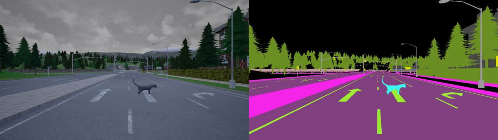

# Open Set Semantic Segmentation

---

## Introduction
Over the last few years, a large portion of the semantic segmentation literature has been focusing on improving the segmentation performance on urban-scene images. However, traditional semantic segmentation methods cannot identify *unexpected objects* (i.e. object not included in the pre-defined classes seen during training), as they predict all pixels as belonging to one of those pre-defined classes. Addressing such an issue is crucial, especially for safety-critical applications such as autonomous driving: wrongly predicting a cat (i.e. an unexpected object) on the road as the road itself does not stop the autonomous vehicle, which may lead to roadkill. In this safety-critical scenario, the cat should be detected as an unexpected object; this information should then prompt the autonomous vehicle to handle the object differently (e.g. decide whether to stop the car or circumvent the cat).

This task, which I will call ***semantic segmentation of unexpected objects on roads***, is more generally referred to in the literature as *open-set semantic segmentation*, *open-world semantic segmentation*, or *anomaly segmentation*, each with slightly different nuances of meaning depending on the paper (it would not be true deep learning otherwise).

## Dataset
The dataset is called StreetHazards [[1](https://arxiv.org/abs/1911.11132)]. It was created with the [CARLA](https://carla.org/) simulation environment in combination with Unreal Engine in order to realistically insert anomalous objects into synthetic urban scenes. The dataset contains 5125 training `(image, segmentation_map)` pairs, 1031 validation pairs, and 1500 test pairs. The training and validation sets feature 12 classes: `building`, `fence`, `other`, `pedestrian`, `pole`, `road line`, `road`, `sidewalk`, `vegetation`, `car`, `wall`, and `traffic sign`. The 13th class is the `anomaly` class, which appears in the test set only.

* [Training and validation sets download link](https://people.eecs.berkeley.edu/~hendrycks/streethazards_train.tar)
* [Test set download link](https://people.eecs.berkeley.edu/~hendrycks/streethazards_test.tar)

Here is an example of a test pair, where a single anomalous object appears (a cat):

  

Segmentation maps like the one above can be produced with [this script](utils/visualize.py).

## Goal
The goal is to implement a model that is able to predict segmentation maps of input images, including masks of both known classes and the `anomaly` class. Test set `(image, semgmentation_map)` pairs (and, hence, the `anomaly` class) should remain **unseen** during training and only be used at test time.
